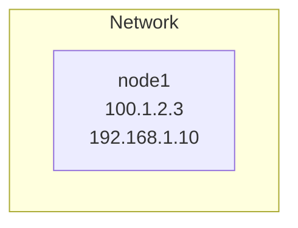

# AGENTS.md

## Project overview

Self-hosted homelab infrastructure documentation. Repository contains configuration code (Terraform, Ansible) and
technical documentation for Proxmox VE cluster, LXC containers, VPS servers, Raspberry Pi devices, and self-hosted
services.

## Configuration examples

Show configuration with `REDACTED` placeholder for sensitive values:

```yaml
property:
  access_key_id: "REDACTED"
  secret_access_key: "REDACTED"
```

## Command examples

Provide full command with context:

```bash
# Show cluster status
pvecm status

# Check storage
pvesm status
```

## Specifications

Use bullet lists for hardware specifications:

```markdown
- CPU Intel i5-9500T 2.2-3.7GHz, 6 cores
- 32GB RAM DDR4 2666MHz
- 256 GB SSD, Samsung PM981 (NVMe, TLC)
```

## References

Link to external documentation when applicable:

```markdown
References:

- <https://example.com/product/>
- <https://example.com/documentation/>
```

## Cross-references

Link to related documentation:

```markdown
See [Backup](backup.md) for detailed configuration.
See [Terraform definition](../terraform/wieprz/main.tf) for container specification.
```

## Diagrams

Use Mermaid for diagrams:

````markdown

````

## Notes and tips

Use blockquotes for important notes:

```markdown
> [!TIP]
> Helpful information for users
```

## Writing style

### Tone

- *Concise*: Short sentences, minimal explanation
- *Technical*: Commands, configurations, specifications
- *Factual*: "What" and "how", not "why"
- *Present tense*: "Configure datastore", not "Configuring datastore"

## Naming

- Use backticks for: hostnames, commands, filenames, configuration keys
- Use quotes for: literal values, identifiers
- Use plaintext for: descriptions, explanations

## Examples

Good:

```markdown
Configure backup user:
- Username: `backup`
- Realm: `pbs`
- Permissions: `Datastore: backup, Role: DatastoreBackup`
```

Avoid:

```markdown
You should configure the backup user with the username "backup" and realm "pbs".
Then set the permissions to allow access to the datastore.
```

## Updating documentation

When infrastructure changes:

1. Update relevant documentation file in `docs/` folder
2. Update Terraform/Ansible code as needed
3. Keep code and documentation in sync
4. Commit both code and documentation changes together
