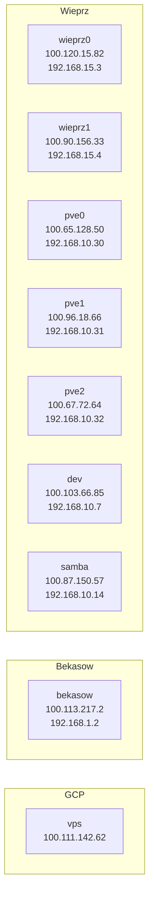

# Network

## VPN

Tailscale machines:

Nodes `wieprz0`, `wieprz1`, `bekasow`, and `vps` act as proxies.
All Tailnet members can connect to these nodes on port `443` for secure communication.
For detailed configuration, refer to the [Terraform configuration file](../terraform/tailscale/main.tf).

Other nodes can be accessed only by Tailnet owners (me).

## DNS

### Wieprz

Cloudflare:

* `*.wieprz.org` → `100.120.15.82` (or `100.90.156.33` as backup)

Adguard rewrites

* `*.wieprz.org` → `192.168.15.3`
* `*.bekasow.duckdns.org` → `100.113.217.2`

Router DNS Proxy:

* `1.1.1.1`
* `1.0.0.1`

### Bekasow

DuckDns:

* `*.bekasow.duckdns.org` → `100.113.217.2`

Adguard:

* `*.bekasow.duckdns.org` → `192.168.1.2`
* `*.wieprz.org` → `100.120.15.82` (or `100.90.156.33` as backup)

### VPS

DuckDns:

* `*.vps64.duckdns.org` → `100.111.142.62`

## VLANs

VLANs numbering scheme `192.168.XX.YYY` where `XX` is one of:

1. `10` - Management
2. `15` - Services
3. `20` - Home
4. `25` - Gaming
5. `30` - Cameras
6. `40` - IoT
7. `50` - Guest

VLANs ACLs:

| Network | WAN | Management | Services | IoT | Other VLANs | Peers |
| ------- | :-: | :--------: | :------: | :-: | :---------: | :---: |
| Management | 🟢 | 🟢 | 🟢 | 🟢 | 🟢 | 🟢 |
| Services | 🟢 | 🟢 | 🟢 | 🚫 | 🚫 | 🟢 |
| Home | 🟢 | 🚫 | 🟢 | 🟢 | 🚫 | 🟢 |
| Gaming |  🟢 | 🚫 | 🟢 | 🚫 | 🚫 | 🟢 |
| IoT | 🟢 | 🚫 | 🟢 | 🚫 | 🚫 | 🚫 |
| Cameras | 🚫 | 🚫 | 🟢 | 🚫 | 🚫 | 🚫 |
| Guests | 🟢 | 🚫 | 🟢 | 🚫 | 🚫 | 🚫 |

### Management LAN

Addressing scheme:

* `192.168.10.1` - gateway
* `192.168.10.2-29` - virtual machines / linux containers
* `192.168.10.30-32` - Proxmox nodes
* `192.168.10.98` - WiFi access Point (EAP610)
* `192.168.10.99` - Switch (TL-SG2428P)
* `192.168.10.100-254` - DHCP

### Services LAN

* `192.168.15.1` - gateway
* `192.168.15.2` - jump host
* `192.168.15.3-99` - virtual machines / linux containers
* `192.168.15.100-254` - DHCP

### Home/Gaming LAN

* `192.168.20.1` - gateway
* `192.168.20.2` - jump host
* `192.168.20.3-99` - reserved
* `192.168.20.100-254` - DHCP

### Cameras LAN

* `192.168.30.1` - gateway
* `192.168.30.2` - jump host
* `192.168.30.3-9` - reserved
* `192.168.30.10-99` - cameras (DHCP reservations)
* `192.168.30.100-254` - DHCP

### IoT LAN

* `192.168.40.1` - gateway
* `192.168.40.2` - jump host
* `192.168.40.3-9` - reserved
* `192.168.40.10-99` - IoT devices (DHCP reservations)
* `192.168.40.100-254` - DHCP

### Guest LAN

* `192.168.50.1` - gateway
* `192.168.50.2` - jump host
* `192.168.50.3-99` - reserved
* `192.168.50.100-254` - DHCP
